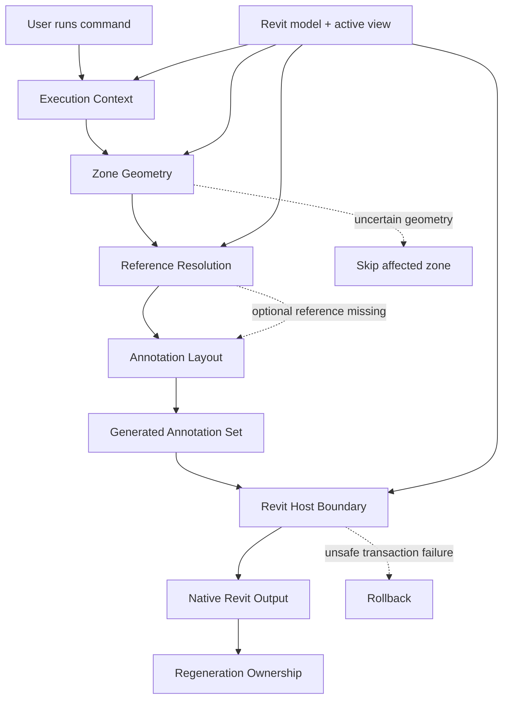
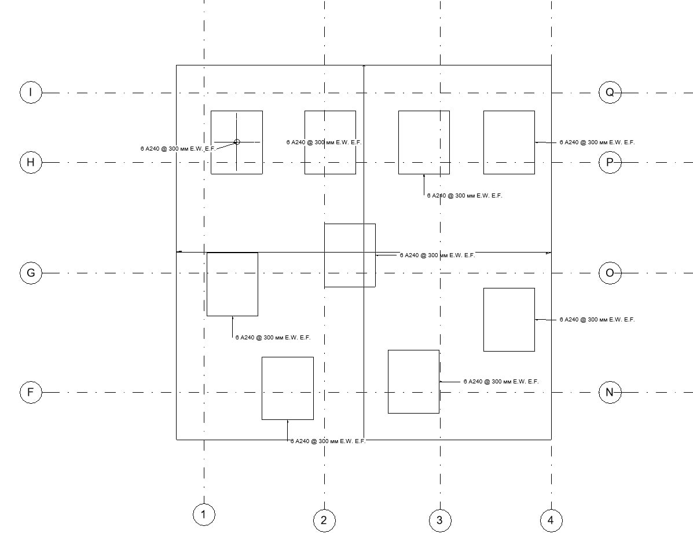
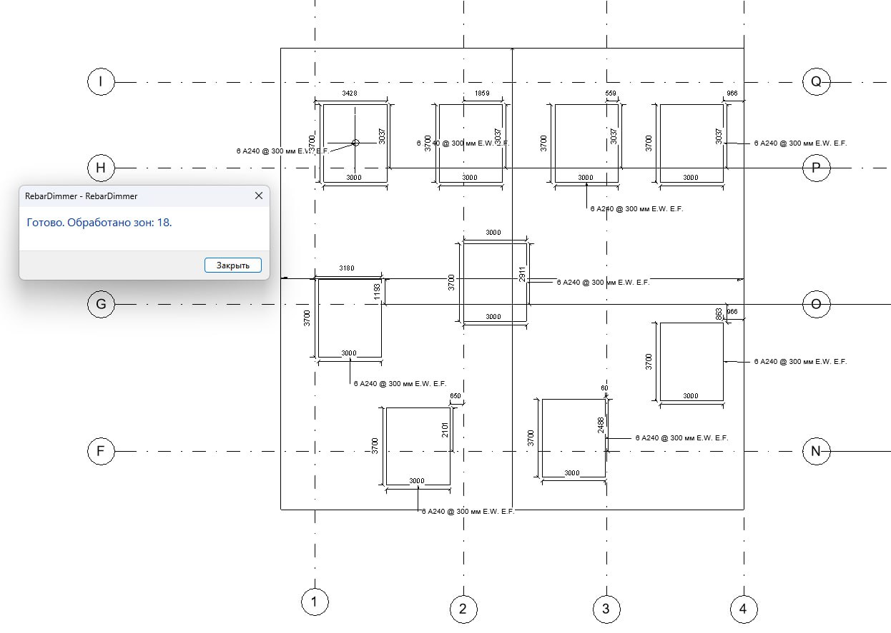

# Rebar AutoDim — System Analysis

> **SSAD-based system-analysis case for deterministic dimensioning of rectangular `Area Reinforcement` zones in Autodesk Revit 2025.**

Rebar AutoDim is a real implemented Revit plugin that replaces repetitive manual reinforcement annotation with a view-aware, geometry-driven and regenerable native annotation workflow.

This repository is being structured with **[SSAD — System-Structured Analysis Documentation](https://github.com/branch-danya-dev/ssad-methodology)**.

The system knowledge is organized around what the plugin is responsible for, not around document types such as `requirements`, `design`, `API` or `errors`.

---

## System problem

Before automation, engineers manually processed each supported reinforcement zone:

- interpreted the zone geometry on the current drawing view;
- created supporting geometry where necessary;
- added overall width and height dimensions;
- searched for suitable structural grids;
- created grid-offset dimensions;
- adjusted parallel annotation lines;
- repeated the work after model changes.

The model already contained the structural evidence, but there was no deterministic system that transformed that evidence into a complete annotation result.

---

## System meaning

Rebar AutoDim does not own reinforcement design.

It owns the transformation:

```text
CURRENT REVIT MODEL + ACTIVE VIEW
        ↓
execution context
        ↓
normalized zone geometry
        ↓
valid dimension references
        ↓
dimension intent + layout
        ↓
native annotation result
        ↓
regenerable plugin-owned output
```

Core invariant:

> **The plugin reads structural truth and writes its own annotation layer. It must not change source reinforcement geometry to make annotation easier.**

---

## Responsibility structure

```text
system/
├─ cross-system boundary, invariants and synthesis
│
execution-context/
├─ active view, local coordinate frame and candidate-zone scope
│
geometry/
├─ supported rectangular-zone interpretation and validity
│
references/
├─ directional structural references and dimensionable-reference meaning
│
layout/
├─ dimension intent, sides, offsets and scale-aware placement
│
annotations/
├─ native generated annotation-set semantics
│
regeneration/
├─ generated-output ownership, replacement and repeated execution
│
revit-boundary/
├─ Revit API evidence, read/write scope, references and transactions
│
evidence/
└─ before/after and implementation outcome evidence
```

Start with [`system/`](system/README.md).

---

## Core responsibility flow



---

## Important distinctions

### View orientation is not project orientation

Width, height and directional placement are interpreted in the active-view coordinate frame.

```text
Model XYZ
   ↓
Active View
   ↓
(u, v, w)
```

This prevents annotation behavior from depending on global project-axis orientation.

See [`execution-context/`](execution-context/README.md) and [`geometry/`](geometry/README.md).

### Structural target is not a Revit API reference

The system first decides **what should be referenced**.

Only then does it determine **how that intent can be represented through Revit-compatible `Reference` objects**.

```text
semantic target
        ↓
reference realization
        ↓
ReferenceArray
        ↓
native Revit dimension
```

A Revit API workaround must not change the structural meaning of the dimension.

See [`references/`](references/README.md) and [`revit-boundary/`](revit-boundary/README.md).

### Nearest grid is directional

The nearest structural grid is selected independently for `left`, `right`, `above` and `below`.

```text
          Above
            ↑
            │
Left ← [ Zone ] → Right
            │
            ↓
          Below
```

A globally closer grid on the wrong side is not valid for that direction.

See [`references/`](references/README.md).

### Missing optional grid is not an invalid zone

A valid zone always targets overall width/height dimensions.

Grid-offset dimensions are conditional on a meaningful reference for that side.

```text
valid zone
→ width + height

left grid found
→ left offset dimension

right grid missing
→ no right offset dimension
```

### Re-run is replacement, not append

```text
Previous plugin-owned result
        ↓
Remove
        ↓
Read current Revit state
        ↓
Recalculate
        ↓
Create one new current result
```

Repeated execution should converge to an equivalent annotation result rather than accumulate duplicate dimensions.

See [`regeneration/`](regeneration/README.md).

---

## Revit boundary

Revit remains authoritative for model/view state and native API validity.

The plugin reads:

- active document and view;
- `Area Reinforcement` identity and geometry;
- structural grids;
- existing plugin metadata.

The plugin writes only its generated annotation layer:

- supporting detail curves;
- native dimensions;
- plugin-owned generated groups/elements;
- generation metadata.

All writes must respect Revit transaction semantics.

See [`revit-boundary/`](revit-boundary/README.md).

---

## Failure philosophy

The central safety rule is:

> **A missing annotation is preferable to an annotation that confidently misrepresents uncertain geometry or an invalid reference.**

Failures are kept local where possible:

```text
unsupported view
→ stop before writes

invalid zone geometry
→ skip zone

missing optional grid
→ omit affected grid dimension

invalid optional dimension reference
→ skip affected dimension when safe

transaction safety failure
→ rollback affected write scope
```

Detailed failure knowledge will be migrated from the legacy documents into the responsibility that owns each condition.

---

## Before / After evidence

| Before | After |
|---|---|
| Manual zone-by-zone annotation | One deterministic command per active view |
| Manual grid selection | Directional reference resolution |
| Manual dimension placement | Rule-based layout |
| Duplicate-prone reruns | Full regeneration |

### Before



### After



The screenshots are implementation evidence. Canonical system rules live in the responsibility areas above.

See [`evidence/`](evidence/README.md).

---

## Structural migration status

The original repository is organized as a document/process sequence:

```text
01-Scope-and-Problem/
02-AS-IS-and-TO-BE/
03-Requirements/
04-System-Design/
05-Geometry-and-Placement/
06-Revit-API-Interaction/
07-Errors-and-Rerun/
08-Traceability/
09-Result/
```

Those files are temporarily retained as **migration sources**.

They are not the target SSAD knowledge architecture.

The migration audit lives in [`system/legacy-knowledge-map.md`](system/legacy-knowledge-map.md).

The next passes will:

```text
legacy claims
→ assign canonical owner
→ preserve useful BR/FR/NFR/AC traceability
→ migrate diagrams near their owners
→ relocate outcome evidence
→ remove superseded numbered artifact tree
```

No legacy file should be removed until its useful knowledge is represented by the active canonical model.

---

## Why this is an interesting SSAD case

This project has a very different shape from both a service-oriented product and an enterprise migration programme.

It is a **host-application automation system** where:

- Revit owns the underlying model and API rules;
- the plugin owns a narrow analytical transformation;
- geometry meaning depends on active-view context;
- semantic references must be translated into host-compatible references;
- native write operations require transaction safety;
- generated output has its own ownership and regeneration lifecycle.

That makes it useful for testing whether SSAD can separate:

```text
system meaning
from
host API mechanics
```

without losing implementation awareness.

---

## Project outcome

The solution was implemented, accepted by the customer and introduced into regular company use.

It replaced repetitive manual reinforcement annotation with a deterministic Revit API-based workflow.

The existing implementation/project outcome is retained under [`09-Result/outcome.md`](09-Result/outcome.md) while evidence migration is in progress.

---

## Tech context

`Autodesk Revit 2025` · `Revit API` · `C#` · `.NET`

---

## Methodology

**[SSAD — System-Structured Analysis Documentation](https://github.com/branch-danya-dev/ssad-methodology)**

> **The system determines the knowledge structure. Document types do not.**
