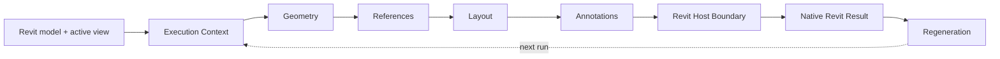

# Rebar AutoDim — System Analysis

> **SSAD-based analysis of a real Autodesk Revit 2025 plugin for deterministic dimensioning of rectangular `Area Reinforcement` zones.**

Rebar AutoDim transforms existing structural model evidence into native drawing annotations while keeping reinforcement design data read-only.

The repository is structured with **[SSAD — System-Structured Analysis Documentation](https://github.com/branch-danya-dev/ssad-methodology)** around stable system responsibilities rather than document types or implementation class names.

---

## System in one flow



Core invariant:

> **The plugin reads structural truth and writes its own annotation layer. It does not modify reinforcement design data to make annotation easier.**

---

## Responsibility structure

```text
system/
├─ cross-system invariants, outcomes and synthesis
│
execution-context/
├─ active view, command scope and zone eligibility
│
geometry/
├─ view-relative rectangular zone semantics
│
references/
├─ semantic boundary/grid targets and directional selection
│
layout/
├─ deterministic side/offset placement policy
│
annotations/
├─ composition and completeness of one generated result
│
regeneration/
├─ source → current-result ownership and rerun lifecycle
│
revit-boundary/
├─ native references, writes, transactions and rollback
│
evidence/
└─ before/after, outcome and historical traceability
```

Start with [`system/`](system/README.md).

---

## What each area answers

| Area | Canonical question |
|---|---|
| [`execution-context/`](execution-context/README.md) | Where may the command run, and what enters this execution? |
| [`geometry/`](geometry/README.md) | What does this reinforcement zone mean in the active view? |
| [`references/`](references/README.md) | What boundaries/grids should the dimensions refer to? |
| [`layout/`](layout/README.md) | Where should each intended dimension be placed? |
| [`annotations/`](annotations/README.md) | What constitutes one complete generated annotation result? |
| [`regeneration/`](regeneration/README.md) | Which generated result is current, and how is it replaced? |
| [`revit-boundary/`](revit-boundary/README.md) | Can Revit safely realize the intended result? |
| [`system/`](system/README.md) | Do the local models form one coherent system behavior? |

---

## Key analytical distinctions

### View frame != project axes

```text
Model XYZ
→ active-view coordinate frame
→ annotation Left / Right / Bottom / Top
```

Width, height and directional placement are interpreted relative to the active view.

See [`geometry/zone-model.md`](geometry/zone-model.md).

### Semantic target != Revit `Reference`

```text
what should be dimensioned
→ semantic target

how Revit can dimension it
→ native Reference realization
```

A supporting detail curve may technically realize a zone boundary reference, but that workaround does not own the structural meaning.

See [`references/reference-policy.md`](references/reference-policy.md) and [`revit-boundary/transaction-and-failure-model.md`](revit-boundary/transaction-and-failure-model.md).

### Missing optional grid != failed dimension

```text
no valid right-side grid
→ right-grid offset NOT_APPLICABLE

valid right-side target exists
but native dimension cannot be created
→ FAILED_WRITE
```

The first is a valid result shape. The second is a realization failure.

See [`annotations/result-model.md`](annotations/result-model.md) and [`system/processing-outcomes.md`](system/processing-outcomes.md).

### Valid geometry != committed annotation result

For an eligible zone:

```text
Geometry valid
        ↓
mandatory width + height targets
        ↓
conditional grid targets
        ↓
valid placement
        ↓
zone write transaction
        ↓
COMMITTED or ROLLBACK
```

A zone is not successfully annotated merely because geometry analysis succeeded.

### Rerun != append

```text
old plugin-owned result
→ replace transactionally
→ reread current evidence
→ recalculate
→ one new current result
```

Repeated execution converges to an equivalent result instead of accumulating duplicates.

See [`regeneration/result-lifecycle.md`](regeneration/result-lifecycle.md).

---

## Zone-level atomicity

The system processes all supported zones on the active view, but each zone is an independently meaningful generated result.

The historical implementation interaction already used a write transaction per supported zone. The canonical model explains why:

```text
Zone A → commit
Zone B → rollback / skip
Zone C → commit
```

A local failure should not invalidate unrelated valid zones where Revit permits safe isolation.

See [`revit-boundary/transaction-and-failure-model.md`](revit-boundary/transaction-and-failure-model.md).

---

## Before / After evidence

| Before | After |
|---|---|
| Manual zone-by-zone processing | One command for all supported zones on the active view |
| Manual geometry interpretation | View-relative normalized geometry |
| Manual grid selection | Directional reference policy |
| Manual placement | Deterministic placement stacks |
| Manual correction after changes | Full generated-result regeneration |

### Before


### After


The solution was implemented, accepted by the customer and introduced into regular company use.

See [`evidence/outcome.md`](evidence/outcome.md).

---

## Historical traceability

The repository originally used a numbered document tree with separate scope, requirements, design, geometry, API, errors and traceability sections.

During SSAD migration, each individual claim was assigned to a canonical responsibility owner.

All historical identifiers remain accounted for:

```text
BR-001..016
FR-001..022
NFR-001..012
AC-001..022
```

They now serve as evidence anchors rather than repository architecture.

See:

- [`evidence/legacy-traceability.md`](evidence/legacy-traceability.md);
- [`system/legacy-knowledge-map.md`](system/legacy-knowledge-map.md).

Historical source files remain available through Git history and no longer compete with active knowledge.

---

## Why this is a useful SSAD case

Rebar AutoDim is a **host-application automation system**, materially different from both a service-oriented product and an enterprise transformation programme.

It tests whether SSAD can keep these concerns separate while remaining implementation-aware:

```text
system meaning
!= host API mechanics

semantic ownership
!= source data ownership

annotation intent
!= native representation

generated state ownership
!= source model ownership
```

The resulting repository structure follows the responsibilities of this system rather than a universal SSAD folder template.

---

## Tech context

`Autodesk Revit 2025` · `Revit API` · `C#` · `.NET`

---

## Methodology

**[SSAD — System-Structured Analysis Documentation](https://github.com/branch-danya-dev/ssad-methodology)**

> **The system determines the knowledge structure. Document types do not.**
