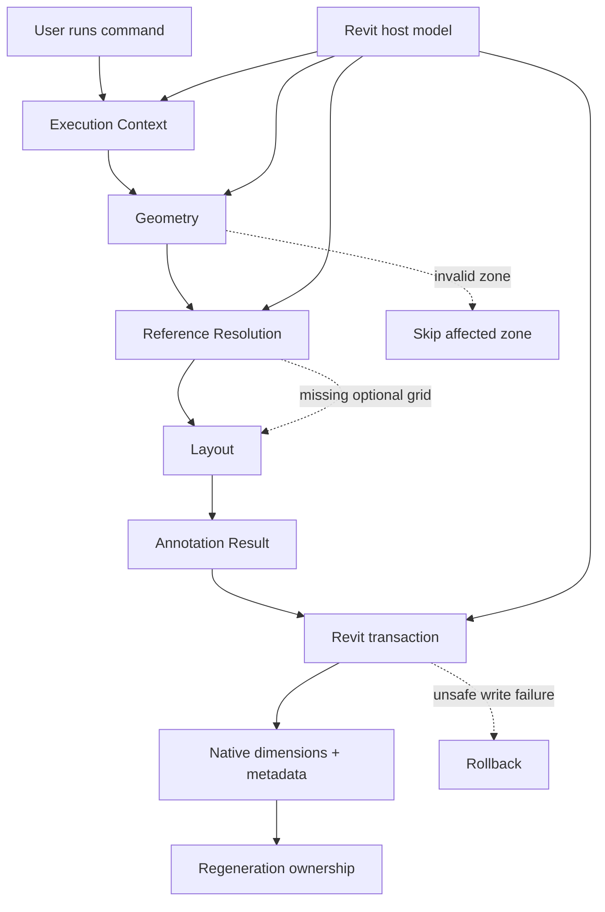

# System View

This area owns the **cross-system meaning** of Rebar AutoDim.

Rebar AutoDim is not modeled as a collection of Revit API calls. It is a deterministic annotation system that interprets structural model geometry in the context of an active view and produces a regenerable native annotation result without changing the source reinforcement design.

## System boundary

Inside the analyzed system:

- command execution scope;
- interpretation of the active Revit view;
- supported `Area Reinforcement` selection;
- normalized reinforcement-zone geometry;
- structural-reference resolution;
- dimension intent and placement;
- generated annotation-set semantics;
- tracking and regeneration of plugin-owned output;
- failure isolation and transaction safety.

Outside the system but relevant through boundaries:

- Autodesk Revit internals;
- structural-design ownership of `Area Reinforcement`;
- project-wide grid modeling decisions;
- manually created annotations unrelated to plugin output;
- arbitrary annotation collision solving;
- unsupported reinforcement shapes and unsupported view types.

Revit owns the host model and API behavior. Rebar AutoDim owns how valid model evidence is interpreted into its annotation result.

## Responsibility map

```text
EXECUTION CONTEXT
what view and source zones are being processed?
        ↓
GEOMETRY
what does each supported zone mean in view coordinates?
        ↓
REFERENCES
which model/reference objects may dimension that geometry?
        ↓
LAYOUT
which dimensions should exist and where should they be placed?
        ↓
ANNOTATIONS
what native Revit annotation result represents that intent?
        ↓
REGENERATION
how is plugin-owned output replaced safely on the next run?
```

`revit-boundary/` describes the host/API constraints used by all of these responsibilities.

## Core invariants

```text
source reinforcement geometry
!= generated annotation geometry

model XYZ orientation
!= drawing/view orientation

nearest grid globally
!= nearest valid grid for a direction

missing optional grid reference
!= invalid reinforcement zone

successful Revit element creation
!= permission to modify source reinforcement

re-run
!= append another annotation set

uncertain geometry/reference
→ do not generate an uncertain dimension
```

The detailed rules should live with the responsibility that owns them rather than in a global business-rules document.

## End-to-end system flow



## Evidence status

This repository describes a real implemented Revit automation case.

The important distinction is:

```text
CANONICAL SYSTEM KNOWLEDGE
→ what the plugin must mean and guarantee

IMPLEMENTATION EVIDENCE
→ how Revit API constructs, components and code realize that meaning
```

Implementation evidence may reveal new facts and force the system model to reopen, but a class name or API method is not automatically the canonical owner of a system rule.

## Related areas

- [`execution-context/`](../execution-context/) — active-view scope and candidate processing context;
- [`geometry/`](../geometry/) — normalized zone semantics;
- [`references/`](../references/) — directional grids and dimensionable references;
- [`layout/`](../layout/) — dimension intent and placement policy;
- [`annotations/`](../annotations/) — native generated result semantics;
- [`regeneration/`](../regeneration/) — repeated execution and generated-output ownership;
- [`revit-boundary/`](../revit-boundary/) — host API, transactions and read/write boundary;
- [`evidence/`](../evidence/) — screenshots and outcome evidence.
