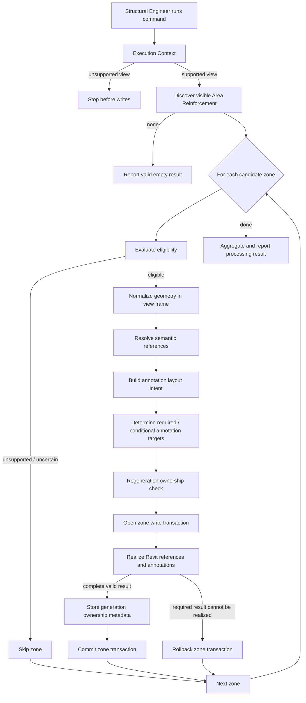

# Rebar AutoDim — End-to-End Processing Flow

This is the system-synthesis view of one command execution.

It connects local responsibility areas without making this file the owner of their detailed rules.

## Responsibility handoffs

| Step | Canonical owner | Output / decision |
|---|---|---|
| View validation and discovery | [`execution-context/`](../execution-context/README.md) | supported context + candidate zones |
| Zone interpretation | [`geometry/`](../geometry/README.md) | normalized `ZoneGeometry` |
| What should be referenced | [`references/`](../references/README.md) | semantic boundary/grid targets |
| Where annotation should appear | [`layout/`](../layout/README.md) | deterministic layout intent |
| What constitutes the generated result | [`annotations/`](../annotations/README.md) | mandatory and conditional targets |
| Which existing output belongs to the zone | [`regeneration/`](../regeneration/README.md) | previous/current result ownership |
| Native Revit realization | [`revit-boundary/`](../revit-boundary/README.md) | valid native elements or rollback |
| Cross-system outcome | [`system/processing-outcomes.md`](processing-outcomes.md) | zone + command result semantics |

## Important boundary

This flow does not mean each responsibility must map to one implementation class.

It describes semantic ownership. The implementation may combine or split code as long as these system meanings remain explicit and consistent.
